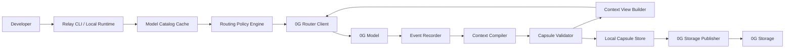

# Relay Architecture

Relay is a shared-context runtime for 0G models.

Its job is not to copy a chat transcript from one model to another. Its job is to keep an external, evidence-backed task memory that any 0G model can continue from safely.

In one sentence:

> 0G gives developers many models; Relay gives those models shared working memory.

## 1. Product boundary

Relay should make this possible:

```txt
Start with a cheap/private 0G model
        ↓
Capture what happened as structured task memory
        ↓
Switch to a stronger/long-context/vision model
        ↓
Continue from verified state, not a pasted transcript
        ↓
Store the capsule on 0G Storage so it can be resumed later
```

Relay must transfer:

- Task goal and acceptance criteria
- Current task status
- Verified facts
- Unverified claims
- Decisions made
- Failed attempts
- Tool/model outputs worth preserving
- Token/cost/provenance metadata
- The next best action
- Optional project/repository state for coding tasks

Relay must not pretend to transfer:

- Hidden reasoning
- Native model memory
- Provider-side session state
- User wallet keys or API keys
- Tool permissions
- Unverified claims as facts
- Raw private transcripts by default

The core product rule is:

> Relay passes task state, not model consciousness.

## 2. What is confirmed from 0G docs

This architecture depends only on documented 0G capabilities.

Confirmed 0G Compute Router capabilities:

- Router provides one endpoint, one API key, and access to models across the Compute Network.
- Router handles provider discovery, billing, authentication, and failover.
- Router is OpenAI/Anthropic-compatible, so standard SDK clients can be used with a changed `base_url` and API key.
- Router uses a single unified on-chain balance across models/providers. Direct/Advanced mode uses per-provider sub-accounts and should not be the MVP default.
- `GET /v1/models` returns the live model catalog with pricing, context length, provider count, and capability metadata.
- Model capability flags must be checked before relying on tool calling, vision, or JSON mode; unsupported `tools` requests return `400 Bad Request`.
- Chat completions support streaming, tool calling, JSON mode, and reasoning-token models when supported by the selected model.
- Every Router response carries `x_0g_trace` metadata including request ID, provider address, and exact billing.
- `verify_tee: true` asks the Router to verify the provider TEE signature and return `tee_verified` in the trace.
- Independent verification is possible through the 0G Compute TypeScript SDK or by checking the provider service record/signature directly.
- Provider routing can be influenced with headers for lowest latency, lowest price, a pinned provider, and trust mode.
- Trust mode can restrict routing to `verified` or `private` providers.
- API keys are server-side secrets; they must not be shipped to browsers.

Confirmed 0G Storage capabilities:

- 0G Storage SDKs support file upload and download.
- Upload returns Merkle root/hash data that can be used for later retrieval.
- Downloads can enable Merkle proof verification.
- The TypeScript SDK supports client-side encryption modes, including AES-256 and ECIES, so the storage network does not need plaintext.
- Browser download has limitations in the SDK; a CLI/server implementation is the safer MVP path.

Primary docs:

- [0G Compute Router overview](https://docs.0g.ai/developer-hub/building-on-0g/compute-network/router/overview)
- [0G Router models](https://docs.0g.ai/developer-hub/building-on-0g/compute-network/router/models)
- [0G Chat Completions](https://docs.0g.ai/developer-hub/building-on-0g/compute-network/router/features/chat-completions)
- [0G Provider Routing](https://docs.0g.ai/developer-hub/building-on-0g/compute-network/router/routing)
- [0G Verifiable Execution](https://docs.0g.ai/developer-hub/building-on-0g/compute-network/router/features/verifiable-execution)
- [0G Deposits & Billing](https://docs.0g.ai/developer-hub/building-on-0g/compute-network/router/account/deposits)
- [0G Router vs Direct](https://docs.0g.ai/developer-hub/building-on-0g/compute-network/router/comparison)
- [0G Storage SDK](https://docs.0g.ai/developer-hub/building-on-0g/storage/sdk)

## 3. Core concept: the Context Capsule

The Context Capsule is Relay's shared memory unit.

It is a structured, versioned object that describes the current state of a task. Each model receives only the capsule view it needs, not the entire history.

```txt
0G Model A response
        ↓
Relay event log
        ↓
Context capsule
        ↓
Compact / standard / deep view
        ↓
0G Model B prompt
```

Minimal capsule shape:

```json
{
  "schema": "relay.context.v1",
  "capsule_id": "ctx_...",
  "created_at": "2026-06-23T00:00:00Z",
  "task": {
    "goal": "Fix checkout failure",
    "acceptance_criteria": [
      "Checkout succeeds",
      "Relevant tests pass"
    ]
  },
  "state": {
    "status": "in_progress",
    "next_action": "Patch checkout/session.ts and rerun checkout.test.ts",
    "blockers": []
  },
  "facts": [
    {
      "id": "fact_001",
      "text": "checkout.test.ts fails before the fix",
      "truth_state": "observed",
      "evidence": ["ev_001"]
    }
  ],
  "claims": [
    {
      "id": "claim_001",
      "text": "The likely root cause is missing refresh-token handling",
      "truth_state": "claimed",
      "evidence": []
    }
  ],
  "decisions": [],
  "evidence": [
    {
      "id": "ev_001",
      "kind": "model_output",
      "source_event": "evt_001",
      "hash": "sha256:..."
    }
  ],
  "model_trace": [
    {
      "model": "zai-org/GLM-5-FP8",
      "provider": "0x...",
      "request_id": "0852f405-...",
      "tee_verified": true,
      "input_tokens": 1200,
      "output_tokens": 400,
      "cost_neuron": "..."
    }
  ],
  "routing": {
    "last_model": "zai-org/GLM-5-FP8",
    "recommended_next_step": "implementation",
    "recommended_mode": "standard"
  }
}
```

Truth states are mandatory:

| State | Meaning |
|---|---|
| `observed` | Directly present in a model/tool response or captured artifact |
| `verified` | Supported by evidence and accepted by Relay validation rules |
| `claimed` | A model said it, but Relay has not proven it |
| `planned` | Intended future work |
| `failed` | Attempted and failed |
| `blocked` | Cannot continue without missing input/access/tooling |
| `stale` | Was once true but later context changed |

This is what prevents Relay from becoming a random summary-sharing tool.

## 4. High-level architecture



Production components:

1. **Relay CLI / Local Runtime**
   - Developer-facing interface.
   - Owns local config, budget settings, API key lookup, capsule storage, and command orchestration.
   - Runs locally first so private task state is not automatically uploaded.

2. **0G Router Client**
   - Calls `/v1/chat/completions`.
   - Uses the standard OpenAI-compatible interface.
   - Adds 0G-specific fields only where needed: `verify_tee`, provider routing headers, trust-mode headers.
   - Records `x_0g_trace` from every response.

3. **Model Catalog Cache**
   - Calls `GET /v1/models`.
   - Stores live model IDs, context length, pricing, provider count, and capability flags.
   - Refreshes on demand and never hardcodes model availability.

4. **Routing Policy Engine**
   - Chooses the cheapest capable model using deterministic rules first.
   - Filters models by hard constraints: context size, tools, JSON mode, vision, trust mode, budget, provider health.
   - Scores eligible models by price, latency preference, task type, and previous failures.
   - Explains every route choice to the user.

5. **Event Recorder**
   - Captures each model request/response pair.
   - Stores prompt hash, response hash, model ID, provider address, request ID, token usage, billing, and TEE verification status.
   - Does not store hidden reasoning as authoritative state.

6. **Context Compiler**
   - Converts raw events into a candidate capsule.
   - Uses JSON mode when supported by the selected compiler model.
   - Produces structured claims with evidence references.
   - May use a cheap reliable model for compilation, but its output is never trusted blindly.

7. **Capsule Validator**
   - Validates schema.
   - Verifies that evidence references exist.
   - Downgrades unsupported claims to `claimed`.
   - Rejects invalid JSON, missing required fields, impossible routing requests, and over-budget handoffs.
   - Can require `tee_verified` for high-trust modes.

8. **Context View Builder**
   - Produces compact, standard, or deep prompts from the same capsule.
   - Estimates token cost before sending.
   - Keeps full history out of model context unless the user explicitly chooses deep mode.

9. **Local Capsule Store**
   - Local-first storage.
   - Stores capsules, event logs, evidence blobs, model traces, and cost records.
   - Recommended implementation: SQLite plus content-addressed files under `.relay/`.

10. **0G Storage Publisher**
    - Encrypts capsule bundles before upload.
    - Uploads to 0G Storage.
    - Records root hash / transaction metadata.
    - Downloads with proof verification.
    - Does not upload plaintext transcripts by default.

## 5. Why Router-first is required

Relay should use 0G Router by default.

Reason:

- Relay is a server-side/CLI agent runtime.
- Router supports OpenAI-compatible calls.
- Router has one API key and one unified on-chain balance.
- Router handles provider discovery and failover.
- Direct/Advanced mode requires manual provider selection and per-provider sub-account funding.

So the MVP should not ask users to deposit to every provider.

Correct MVP path:

```txt
User deposits once to Router balance
        ↓
Relay calls multiple 0G models through Router
        ↓
Router charges the same unified balance
```

Direct can be added later for wallet-connected browser dApps, pinned-provider workflows, or custom settlement requirements.

## 6. Model routing design

Relay should not need a model to choose models in the MVP.

Routing should be deterministic, explainable, and cheap.

Hard filters:

- Does the model fit the required context size?
- Does it support the required capabilities?
  - Chat
  - Tools
  - JSON mode
  - Vision
  - Reasoning tokens, if needed
- Does the user require `private` or `verified` trust mode?
- Is estimated cost below the user budget?
- Is the model available in the live catalog?
- Is provider count healthy enough?

Scoring:

- Lower estimated cost is better.
- Lower latency is better for short tasks.
- Larger context is better only when needed.
- Strong coding models are preferred for implementation.
- Cheap structured-output models are preferred for capsule compilation.
- Vision models are required only when image/video input exists.
- If schema validation fails twice, escalate to a stronger model.

Example routing policy:

```txt
First-pass diagnosis:
  use cheapest model with enough context and required trust mode

Capsule compilation:
  use cheapest model that supports JSON mode and fits the event window

Implementation:
  use coding-capable model with tools if tools are required

Large-context review:
  require context window greater than estimated view size

Private workflow:
  add X-0G-Provider-Trust-Mode: private

Verified workflow:
  add X-0G-Provider-Trust-Mode: verified
  set verify_tee: true
```

Relay should print the reason:

```txt
Selected zai-org/GLM-5-FP8
Reason:
- supports JSON mode
- context fits 18,400 token standard view
- verified trust mode requested
- lowest estimated cost among eligible models
```

Later, Relay can add a model-based routing advisor, but it must remain advisory. Hard constraints and budget limits must always win.

## 7. Context modes are part of the MVP

Modes are essential because they make shared memory token-efficient.

Relay should ship three context modes:

| Mode | Target size | Use case |
|---|---:|---|
| `compact` | 1k-3k tokens | Fast handoff, same task, low cost |
| `standard` | 3k-8k tokens | Default developer workflow |
| `deep` | 10k-30k tokens | Hard debugging, architecture, long-horizon work |

Each mode is a different view of the same capsule.

`compact` includes:

- Goal
- Current state
- Verified facts
- Blockers
- Next action
- Minimal model trace

`standard` includes compact plus:

- Decisions
- Important claims
- Failed attempts
- Selected evidence excerpts
- Recent model trace and cost

`deep` includes standard plus:

- Larger evidence excerpts
- Longer model-output excerpts
- Rejected hypotheses
- Open alternatives
- More complete task history

Relay must show the token estimate before switching:

```txt
Context mode: standard
Estimated handoff: 5,200 tokens
Full event history: 47,800 tokens
Estimated context reduction: 89%
```

If Relay cannot beat a full transcript meaningfully, it should say so. Token savings are a product requirement, not a nice-to-have.

## 8. End-to-end runtime flow

### 8.1 Start a task

```txt
relay run "Find and fix the checkout bug" --auto --mode standard
```

Flow:

1. Relay refreshes the model catalog.
2. Relay estimates the initial context size.
3. Routing policy picks an eligible model.
4. Relay calls 0G Router.
5. Relay records response, `x_0g_trace`, billing, and TEE metadata.
6. Relay compiles a capsule.
7. Validator checks the capsule.
8. User sees current task memory and next step.

### 8.2 Switch models

```txt
relay switch --to <model-id> --mode compact
```

Flow:

1. Relay builds the selected capsule view.
2. Relay verifies the target model can accept the view and required capabilities.
3. Relay estimates input/output cost from live model pricing.
4. Relay prompts or proceeds depending on user budget settings.
5. Relay sends the capsule view to the target model.
6. Target model continues from structured task state.
7. Relay updates the capsule.

### 8.3 Auto route

```txt
relay continue --auto
```

Flow:

1. Relay looks at the next action, capsule size, trust settings, and previous failures.
2. Routing policy filters and scores models.
3. Relay explains the selected model.
4. Relay continues the task.

### 8.4 Publish shared memory

```txt
relay publish
```

Flow:

1. Relay creates a capsule bundle.
2. Relay redacts or excludes raw transcript content unless explicitly enabled.
3. Relay encrypts the bundle client-side.
4. Relay uploads to 0G Storage.
5. Relay saves the returned root hash and transaction metadata.
6. Relay verifies by downloading with proof when required.

Capsule bundle:

```txt
capsule.relay/
  manifest.json
  capsule.json
  events.jsonl
  evidence/
  traces/
  handoff.md
```

The portable identity is:

```txt
relay://0g-storage/<network>/<root-hash>
```

## 9. Prompt contract between Relay and models

Every model continuation should receive a strict system instruction:

```txt
You are continuing a Relay task using a context capsule.

Treat observed and verified facts as usable context.
Treat claimed facts as unverified.
Do not convert claimed facts into completed work.
If you need more evidence, ask Relay for a deeper view.
Return updates in the Relay event schema.
Do not reveal or request secrets.
Do not assume prior model permissions transfer.
```

The model should return a structured event:

```json
{
  "event_type": "model.step.completed",
  "summary": "...",
  "new_facts": [],
  "new_claims": [],
  "decisions": [],
  "next_action": "...",
  "needs": []
}
```

Relay then validates and folds that event into the capsule.

## 10. Security and privacy

Security defaults:

- Local-first storage.
- No plaintext upload by default.
- API keys stay server-side/local CLI only.
- `sk-` inference key and `mk-` management key are stored separately.
- `mk-` keys are only needed for balance/usage/account views.
- Browser clients must not receive 0G Router API keys.
- Use 0G Storage encryption for published capsules.
- Download published capsules with proof verification.
- Treat model outputs and imported capsules as untrusted input until validated.

Trust levels:

| Relay mode | 0G behavior |
|---|---|
| `normal` | Default Router routing |
| `verified` | `X-0G-Provider-Trust-Mode: verified` and `verify_tee: true` |
| `private` | `X-0G-Provider-Trust-Mode: private`; prefer no raw transcript upload |
| `audit` | Require `tee_verified`, store trace metadata, optionally run independent verification |

Important limitation:

`tee_verified: true` means the Router says it verified the provider signature. For stronger guarantees, Relay should support independent verification using the 0G Compute SDK or the documented provider signature flow.

## 11. What is not in the MVP

To avoid over-engineering, the MVP should not include:

- On-chain capsule registry
- Team sharing and device enrollment
- Agentic ID integration
- 0G DA integration
- Browser-first product
- Native Codex/Claude/OpenCode transcript adapters
- Full autonomous coding agent
- Custom smart contracts
- Complex multi-recipient key management

Those are roadmap features.

The MVP should prove:

> 0G model A can produce useful task state, Relay can compile and validate that state, store it as a compact capsule, and 0G model B can continue from that capsule with fewer tokens than a full transcript.

## 12. MVP architecture

Recommended implementation shape:

```txt
relay/
  apps/
    cli/
  packages/
    core/
      capsule/
      events/
      validation/
      context-views/
      routing/
      token-budget/
    integrations/
      zerog-router/
      zerog-storage/
    storage/
      local-store/
  protocol/
    relay.context.v1.schema.json
    relay.event.v1.schema.json
  docs/
    demo-flow.md
```

Recommended language/runtime:

- TypeScript for the MVP.
- Reasons:
  - Works naturally with OpenAI-compatible Router clients.
  - 0G has a TypeScript Storage SDK with encryption support.
  - 0G Compute independent verification examples use the TypeScript SDK.
  - Easy to ship as a developer CLI and later a small web dashboard.

Production hardening can still keep the same protocol if parts later move to Go or Rust.

## 13. MVP commands

Architecture-level command surface:

```txt
relay init
relay models
relay balance

relay run "<task>" --auto --mode standard
relay continue --auto
relay switch --to <model-id> --mode compact

relay capsule inspect
relay capsule validate
relay capsule publish
relay capsule fetch <relay-url>
```

`relay models` should show:

- Model ID
- Context length
- Prompt price
- Completion price
- Capability flags
- Provider count
- Whether JSON/tools/vision are supported
- Whether trust modes are available through providers

`relay switch` should show:

- Selected model
- Reason
- Estimated handoff tokens
- Estimated cost
- Trust mode
- Whether `verify_tee` is enabled

## 14. Data model

### Event

```json
{
  "schema": "relay.event.v1",
  "event_id": "evt_...",
  "timestamp": "2026-06-23T00:00:00Z",
  "kind": "model.response",
  "model": {
    "id": "zai-org/GLM-5-FP8",
    "provider": "0x...",
    "request_id": "..."
  },
  "trace": {
    "tee_verified": true,
    "billing": {
      "input_cost": "...",
      "output_cost": "...",
      "total_cost": "..."
    }
  },
  "content_hash": "sha256:...",
  "payload": {}
}
```

### Capsule

```json
{
  "schema": "relay.context.v1",
  "capsule_id": "ctx_...",
  "parent_capsule_id": "ctx_...",
  "task": {},
  "state": {},
  "facts": [],
  "claims": [],
  "decisions": [],
  "evidence": [],
  "model_trace": [],
  "routing": {},
  "storage": {}
}
```

### Context view

```json
{
  "schema": "relay.view.v1",
  "mode": "standard",
  "source_capsule_id": "ctx_...",
  "estimated_tokens": 5200,
  "sections": [
    "goal",
    "verified_facts",
    "claimed_unverified",
    "decisions",
    "next_action"
  ]
}
```

## 15. Validation rules

Relay must validate before passing memory forward.

Required checks:

- Capsule matches schema.
- Every `verified` fact has evidence.
- Every evidence reference exists.
- Model ID exists in current or cached model catalog.
- Requested target model has enough context window.
- Requested target model supports required capability flags.
- Token estimate is below configured maximum.
- `private` or `verified` mode maps to the correct provider trust header.
- `tee_verified` is present when required by policy.
- Published bundles are encrypted unless user explicitly chooses plaintext.
- Downloaded bundles pass proof verification when fetched from 0G Storage.

Downgrade rules:

- If a model says "tests passed" but no command/tool evidence exists, mark as `claimed`.
- If a previous model suspected a bug but did not prove it, mark as `claimed`.
- If context changed after a fact was recorded, mark as `stale`.
- If TEE verification fails, mark the model response as untrusted and do not use it for verified facts.

## 16. Cost and token strategy

Relay must prove it saves context.

For every handoff, store:

- Full event-history token estimate
- Capsule-view token estimate
- Estimated percentage reduction
- Actual Router billing from `x_0g_trace`
- Model used
- Context mode used

Target:

```txt
compact: 90%+ smaller than full history for normal sessions
standard: 75%+ smaller than full history
deep: smaller than full history, but optimized for difficult tasks
```

If a task is already tiny, Relay should not over-summarize. It can pass the short context directly and say there is no meaningful savings.

## 17. Production proof gates

Before claiming production readiness, Relay must pass these real checks:

1. Router connectivity
   - Real request to testnet or mainnet Router.
   - Real `x_0g_trace` captured.
   - Real billing data recorded.

2. Model catalog
   - Live `/v1/models` read.
   - Capability flags used to avoid unsupported JSON/tools calls.

3. Capsule compilation
   - Real model output produces valid capsule JSON.
   - Invalid model output is rejected or repaired safely.

4. Model switch
   - Model A performs a task step.
   - Relay compiles a capsule.
   - Model B continues from compact/standard/deep capsule.
   - Model B does not need the full transcript.

5. Token proof
   - Handoff token estimate is measured against full-history estimate.
   - Savings are displayed.

6. Storage publish/fetch
   - Encrypted capsule uploaded to 0G Storage.
   - Root hash recorded.
   - Capsule downloaded again.
   - Proof verification enabled.
   - Decryption succeeds.

7. Trust mode
   - `verify_tee: true` request produces trace metadata.
   - Failed or absent verification is handled honestly.

8. Budget control
   - Relay refuses or asks before expensive handoffs.
   - Per-request actual cost is logged.

No mock outputs should be used for these gates.

## 18. Roadmap after MVP

After the MVP proves real switching and storage:

1. Visual dashboard for capsules and token savings.
2. Independent TEE verification mode.
3. Repository-aware coding context: git diff, changed files, command/test evidence.
4. Team sharing with recipient encryption.
5. Optional chain anchoring for capsule lineage.
6. Direct/Advanced mode for wallet-signed dApps.
7. Codex/Claude/OpenCode adapters as external context sources.
8. Agentic ID integration for portable long-term developer preferences.

## 19. Final architecture decision

Relay should be built as:

> A local-first TypeScript CLI/runtime that uses 0G Router for multi-model inference, 0G Storage for encrypted portable context capsules, deterministic validation for truth boundaries, and compact/standard/deep context views to control token burn.

This design works with documented 0G interfaces, avoids the per-provider deposit problem by using Router first, and makes 0G essential to the product instead of decorative.

The MVP is not "share a doc between models."

The MVP is:

> Verified shared task memory for 0G models.
